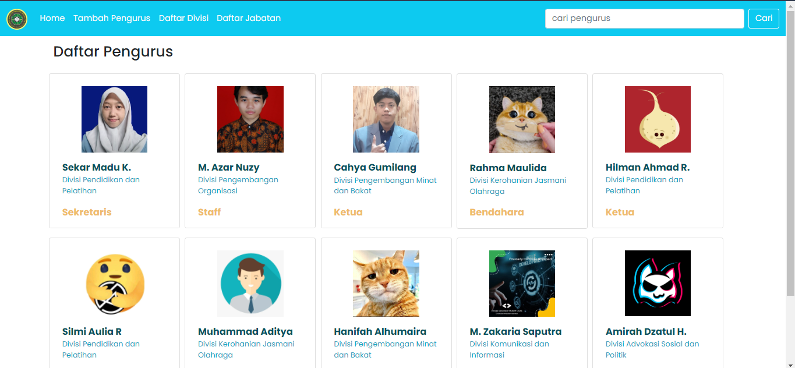
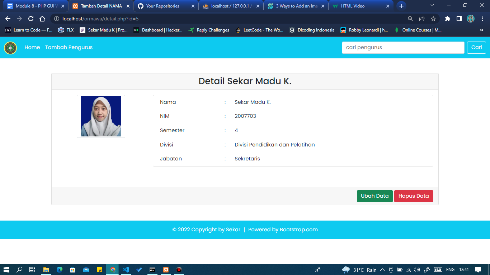
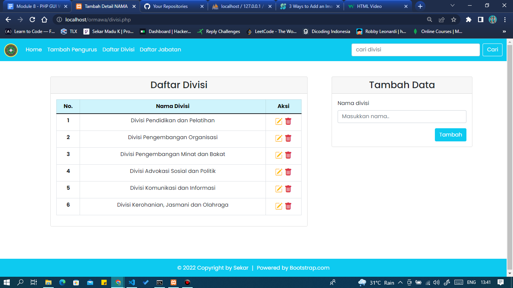
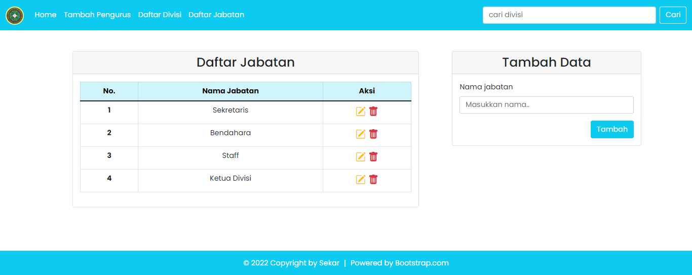
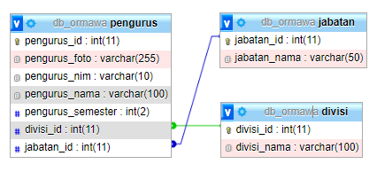

# Tugas Praktikum 2 DPBO 2022
> Sekar Madu Kusumawardani
> 2007703
> Ilmu Komputer - C1
> Universitas Pendidikan Indonesia

Repositori ini dibuat sebagai dokumentasi pengerjaan tugas praktikum 2 dalam mata kuliah Desain dan Pemrograman Berorientasi Objek pada program studi Ilmu Komputer Universitas Pendidikan Indonesia.

### PHP GUI with Multiple Tables
```
Saya Sekar Madu Kusumawardani_2007703 mengerjakan Tugas Praktikum 2 dalam mata kuliah
Desain dan Pemrograman Berorientasi Objek untuk keberkahanNya maka saya tidak
melakukan kecurangan seperti yang telah dispesifikasikan. Aamiin.
```

### Preview

https://user-images.githubusercontent.com/81772600/162903346-d06ed9c8-c255-4c8e-b1a2-a8d47451961c.mp4


#### Home Page


#### Detail Page


#### Divisi Page


#### Jabatan Page


### Database Design

Tabel Pengurus berelasi one to many dengan tabel Divisi dan Jabatan dimana 1 pengurus hanya dapat memiliki 1 divisi dan 1 jabatan, sedangkan 1 jabatan dan divisi dapat memiliki beberapa pengurus.

### Features
- Dashboard daftar pengurus
- Halaman detail pengurus
- Tambah data pengurus
- Edit data pengurus
- Hapus data pengurus
- Cari data pengurus berdasarkan nama, divisi, atau jabatan
- Halaman daftar divisi
- Tambah data divisi
- Edit data divisi
- Hapus data divisi
- Halaman daftar jabatan
- Tambah data jabatan
- Edit data jabatan
- Hapus data jabatan
