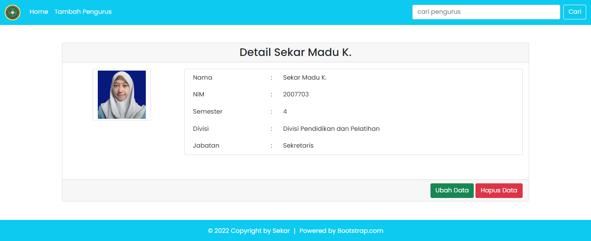
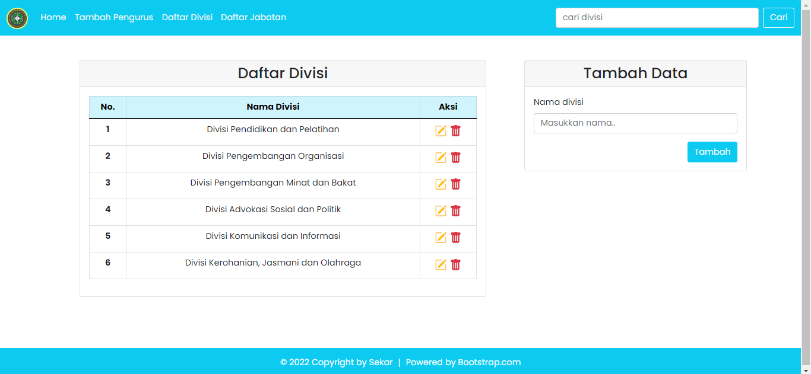

# Tugas Praktikum 2 DPBO 2022
> Sekar Madu Kusumawardani
> 2007703
> Ilmu Komputer - C1
> Universitas Pendidikan Indonesia

Repositori ini dibuat sebagai dokumentasi pengerjaan tugas praktikum 2 dalam mata kuliah Desain dan Pemrograman Berorientasi Objek pada program studi Ilmu Komputer Universitas Pendidikan Indonesia.

### PHP GUI with Multiple Tables
```
Saya Sekar Madu Kusumawardani_2007703 mengerjakan Latihan Praktikum 4 dalam mata kuliah
Desain dan Pemrograman Berorientasi Objek untuk keberkahanNya maka saya tidak
melakukan kecurangan seperti yang telah dispesifikasikan. Aamiin.
```

### Preview
<video width="320" height="240" autoplay>
  <source src="preview.mp4" type="video/mp4">
</video>

#### Home Page

#### Detail Page

#### Divisi Page

#### Jabatan Page


### Database Design


### Features
- Dashboard daftar pengurus
- Halaman detail pengurus
- Tambah data pengurus
- Edit data pengurus
- Hapus data pengurus
- Cari data pengurus berdasarkan nama, divisi, atau jabatan
- Halaman daftar divisi
- Tambah data divisi
- Edit data divisi
- Hapus data divisi
- Halaman daftar jabatan
- Tambah data jabatan
- Edit data jabatan
- Hapus data jabatan